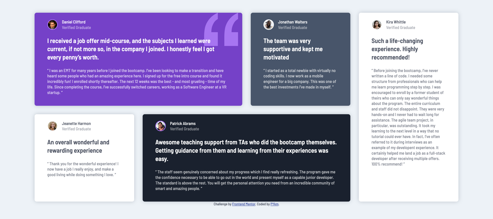
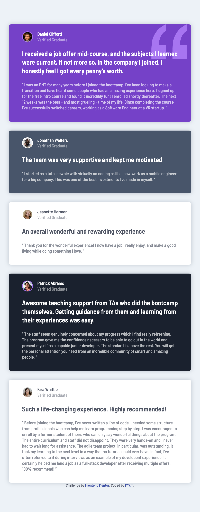

# Frontend Mentor - Testimonials grid section solution

This is a solution to the [Testimonials grid section challenge on Frontend Mentor](https://www.frontendmentor.io/challenges/testimonials-grid-section-Nnw6J7Un7). Frontend Mentor challenges help you improve your coding skills by building realistic projects.

## Table of contents

- [Overview](#overview)
  - [The challenge](#the-challenge)
  - [Screenshot](#screenshot)
  - [Links](#links)
- [My process](#my-process)
  - [Built with](#built-with)
  - [What I learned](#what-i-learned)
  - [Continued development](#continued-development)
- [Author](#author)

## Overview

### The challenge

Users should be able to:

- View the optimal layout for the site depending on their device's screen size

### Screenshot




### Links

- Solution URL: [on Frontend Mentor](https://www.frontendmentor.io/solutions/testimonials-grid-section-NEps27Nhth)
- Live Site URL: [on Github](https://pykm.github.io/testimonials-grid-section/)

## My process

### Built with

- Semantic HTML5 markup
- CSS custom properties
- Flexbox
- CSS Grid
- Mobile-first workflow

### What I learned

I didn't learn any new technique, but I was able to practice my grid skill, and I'm pretty happy about the final layout.

The css code is as below:
```css
/* middle screen */
@media (min-width: 51em) and (max-width: 75em) {
  main {
    grid-template-columns: repeat(3, 1fr);
  }

  figure:first-child {
    grid-column: 1 / 3;
  }

  figure:nth-child(2) {
    grid-row: 2;
  }

  figure:nth-child(3) {
  }

  figure:nth-child(4) {
    grid-column: 2 / 4;
  }

  figure:nth-child(5) {
    grid-column: 1 / 4;
    grid-row: 3;
  }
}

/* large screen */
@media (min-width: 75em) {
  main {
    grid-template-columns: repeat(4, 1fr);
  }

  figure:first-child {
    grid-column: 1 / 3;
  }

  figure:nth-child(2) {
    grid-column: 3 / 4;
  }

  figure:nth-child(3) {
    grid-row: 2;
  }

  figure:nth-child(4) {
    grid-column: 2 / 4;
  }

  figure:nth-child(5) {
    grid-column: 4;
    grid-row: 1 / 3;
  }
}
```

### Continued development

Technique that I found useful, although not using in this challenge:
- SASS

## Author

- Website - [PYkm](https://pykm.github.io/)
- Frontend Mentor - [@PYkm](https://www.frontendmentor.io/profile/PYkm)
